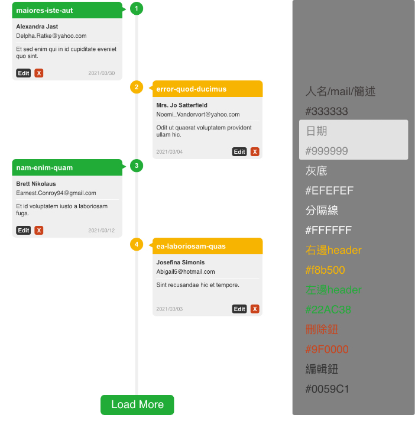
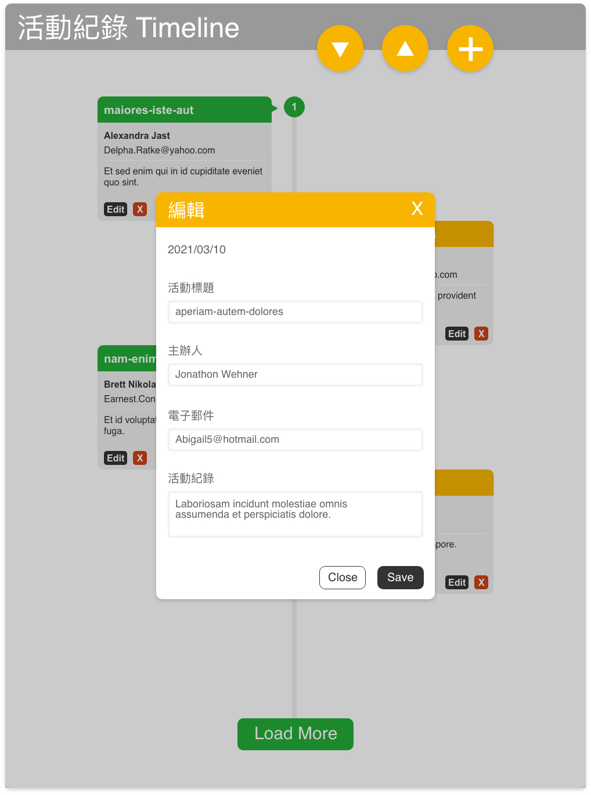

# 前端測驗試題 (可上網查資料)

## 題目：活動紀錄時間軸套件封裝與 API 應用
## 測驗時間：2021/08/05(四) 10:00 ~ 2021/08/09(一) 18:00
## 分支名稱：front-end-test-s1

<hr>

# 程式風格 (Coding Style)

1. ## Javascript 版本：ES6 (ECMAScript 2015)
2. ## 函式需註釋，內容如下：
   - ## 函式用途簡述 (brief)
   - ## 傳入參數描述 (param)
   - ## 如有回傳值需標註意義 (returns)
3. ## 邏輯區域需單行註釋  
4. ## 保持 Clean code，不必要的註解與 console.log 需移除
5. ## SCSS 請採用 BEM 規則

<hr>

# 注意事項

1. ## 請先執行 npm install 安裝依賴套件
2. ## npm 指令說明：

   ### 套件編譯
     ``` text
     npm run build
     ```

   ### Express 服務器執行
     ``` text
     npm run start
     ```   

   ### Express 服務器停止
     ``` text
     npm run stop
     ```   

<hr>

# 測驗內容說明

## 一、請設計一個活動紀錄時間軸套件，設計要求如下：

1. ### 套件名稱: ActivityTimeline，提供樣式與色系參考
   
2. ### 類別 (Class) 封裝的模組輸出檔請使用 src/index.js
3. ### 請應用變更資料重新渲染 DOM 概念
4. ### 請預設下列選項參數供使用者傳入 (Options)：

```js
{
  // 活動紀錄來源資料
  data: [],
  // 預設卡片顯示數
  perItem: 4,
  // 編輯按鈕的 Callback
  onEdit: null,
  // 刪除按鈕的 Callback
  onDelete: null
}
```

5. ### 傳入的資料 (data) 需依據序號 (id) 由小到大排序
6. ### 請提供下列原型鏈方法供使用者使用 (Methods)：

```js
/*
 * 動態設置 ActivityTimeline 選項參數
 * @param {Object} [options] - 更新預設參數
 */
ActivityTimeline.prototype.setOptions(options = {});
/*
 * 新增資料
 * @param {Object} [data] - 回傳的新增資料
 */
ActivityTimeline.prototype.addData(data = {});
/*
 * 更新單筆資料
 * @param {Object} [data] - 回傳的更新資料
 */
ActivityTimeline.prototype.updateData(data = {});
/*
 * 刪除單筆資料
 * @param {Number} [id] - 資料序號
 */
ActivityTimeline.prototype.removeDataByID(id));
/*
 * 排序資料
 * @param {String} [type] - (asc|desc)
 * asc: 小至大
 * desc: 大至小
 */
ActivityTimeline.prototype.sort(type);
```

## 二、套件應用 - 實作 CRUD、排序、串接 API 功能，其要求如下：

1. ### API 實作可使用 Axios 或 jQuery Ajax 技術二選一，API 與欄位資料格式資訊如下：
   - 欄位資料格式說明：
     ``` js
       {
         // 序號
         id: string,
         // 活動標題
         title: string,
         // 主辦人
         name: string,
         // 電子郵件
         email: string,
         // 活動紀錄
         bref: string
         // 當天日期
         datetime: string
       }
     ```
   - 新增資料：POST /activity/record，攜帶參數格式如下：
     ``` js
       {
         id: string,
         title: string,
         name: string,
         email: string,
         bref: string
       }
     ```

   - 取得全部資料：GET /activity/record，取得資料格式如下：
     ``` js
       [{
         id: string,
         title: string,
         name: string,
         email: string,
         bref: string,
         datetime: string
       }]
     ```

   - 取得單筆資料：GET /activity/record/:id，取得資料格式如下：
     ``` js
       [{
         id: string,
         title: string,
         name: string,
         email: string,
         bref: string,
         datetime: string
       }]
     ```  

   - 修改單筆資料：PUT /activity/record/:id，取得資料格式如下：
     ``` js
       {
         id: string,
         title: string,
         name: string,
         email: string,
         bref: string,
         datetime: string
       ]
     ```   

   - 刪除單筆資料：DELETE /activity/record/:id，取得資料格式如下：
     ``` js
       {
         // 指定刪除當筆id
         id: string,
         // 刪除後的整筆資料
         data: array
       }
     ```   
2. ### HTML 樣板請使用 public/index.html
3. ### 彈窗樣板可使用 Bootstrap 4 Modal、bootstrap4-dialog、jQuery UI Dialog 或其他套件不限
4. ### 外部功能操作需求如下 (提供樣板參考)：
   

   - 點擊升冪鈕，套件卡片依據序號由小至大排列
   - 點擊降冪鈕，套件卡片依據序號由大至小排列
   - 點擊新增鈕開啟彈窗，可新增資料
   - 彈窗表單：

     - 日期欄位請顯示當天日期，格式 YYYY/MM/DD
     - 活動標題、主辦人欄位需必填驗證 
     - 電子郵件欄位需必填驗證 + email 格式驗證
     - email 格式驗證規則如下：

       ```text
       (1) 必須以一個以上的文字和數字開頭
       (2) @ 之前可以出現 1 個以上的文字、數字與「-」的組合，例如 -abc-
       (3) @ 之前可以出現 1 個以上的文字、數字與「.」的組合，例如 .abc.
       (4) @ 之前以上兩項以 or 的關係出現，並且出現 0 次以上
       (5) 中間一定要出現一個 @
       (6) @ 之後出現一個以上的大小寫英文及數字的組合
       (7) @ 之後只能出現「.」或是「-」，但這兩個字元不能連續時出現
       (8) @ 之後出現 0 個以上的「.」或是「-」配上大小寫英文及數字的組合
       (9) @ 之後出現 1 個以上的「.」配上大小寫英文及數字的組合，結尾需為大小寫英文

       輸入範例 (正確格式)：
       grace-wang@gmail888.com
       ```
     - 驗證通過才可送出資料

5. ### 套件功能操作：
   
   - 點擊編輯鈕 [Edit] 開啟彈窗，可修改單筆資料
   - 點擊刪除鈕 [X] 開啟彈窗，可刪除單筆資料
   - 點擊 Load More 鈕，可繼續顯示套件選項 perItem 所設定的卡片張數
